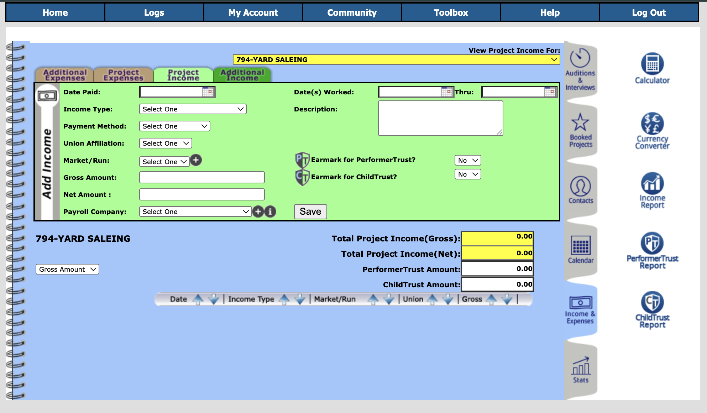

# Actor Database App

# Overview

A robust application which allows for actors to keep track of both their finances as well as their auditions all in one place. The ability to consolidate income and expenses into an annual report to ease with taxes. The ability to enter and search auditions and bookings to keep track of the progress of your career. The ability to sync with a calendar so you know where you need to be and what you have coming up at all times. A database of casting and production folk whom you've come into contact with so you can maximize your connections and stay on top of key industry players.

---

# Home Page

Things that I think we can lose from the homepage are the following tabs in the main body:

***Calendar*** - I think this is an outdated feature and most folks want their applications to sync with whatever calendar application they already use.

***Stats*** - While this may be helpful to have at some point so actors can see their audition to booking ratios I think it would be better served to eliminate for the time being and if re-introduced, make it in the format of a bar graph or something. Something akin to watching a stock's price index over the course of a day, month, year... That way you can track trends of number of auditions this month versus last or even what march's audition numbers looked like for this year versus last year, etc.

We can also lose the middle sections of ***Quickstart guide***, ***FAQ's*** and ***Tech Support***. Those can be drop down menu items from the main nav bar under ***Support*** or some such.

We can also lose the following from the navbar:

***Logs*** - This is essentially convered by the tabs in the main body of the home page.

***Community*** - This area while something you had gotten excited about (Twitter, etc) requires more person power and upkeep than I am willing to commit to at the moment. Looking for a very barebones app to start that doesn't get muddled in trying to do too many things at once and get spread thin.

***Toolbox*** - This area basically sends you off to some other webpages with tips on walking the redcarpet, copies of agreement mock-ups and standard contracts for dealing with non-union productions and procuring a copy and credit for your services as an actor. Again, I want barebones.

The ***Help*** section can be the support area and house the FAQ's and Quickstart/Walkthrough kind of stuff.

---

# Auditions

Currently you have the option of creating a new audition or editing a previously logged audition to change info or to update it to a callback (the next phase of the audition process when you have moved forward from the first round.)

I don't like the fact that in this version it auto-numbers your auditions, lists them in order of most recent to less recent, and doesn't give you the option to search for a specific audition. I think there should be more manipulation options (like you would have in any database) and ability to view things according to many different criteria.

I want streamlined quicker access to the info a user wants.

Here we can see a lot of drop down menus for entering a new audition. There are a lot of outdated types of dropdown selections for different parts of this page that applied to a time when auditions were done more in person or when people sent physical headshots out and follow-up postacrds, etc. So again I want to streamline this area a bit to make it more easy to use and flow with.

Also as a general note, I would like the ability for the user to generate their own dropdown menu titles or clarifications so they can tailor it more specifically to them. This way if they have a different type of expense category they can enter it and make the app more personal for themselves.

On this page I would like to have the following options:

- Title of the Audition - text box for user entry
- What Round it is
    - 1st Audition, Callback, Producer's Callback, Network Test, Screen Test, Other (User created entry)
- Project Type
    - Feature Film, Short Film, Commercial, Industrial, Play, Videogame, Podcast, Music Video, Other (User created entry)
- Date and Time
- Appt Location
    - Here there would be a drop down of previously entered casting spaces or studios (entered via the ***Contacts*** section) you could choose from to pin this audition to, as well as the option of self-tape which is the majority of audition submissions these days. Addresses for physical spaces would also accompany those previously entered entities.
- Role Type
    - Lead, Supporting, Co-Star, Guest Star, Extra, Featured Extra, Background, Voice Over, Live Performance, Other (User created entry)
- Role Name - text box for user entry
- Role Description - text box for user entry
- Union Status
    - SAG/AFTRA, Actor's Equity, WGA,  Other (User created entry)
- Submitted Through
    - Here there would be a drop down menu of representation the actor has entered via the ***Contacts*** section or websites if it was a self submission like through Casting Networks or Actors Access
- Post Audition
    - Area to upload a photo of what you wore and hair style, etc... the look, if you will
    - A drop down menu of contacts so you can highlight who you met with, this can later be used to help create stats about when the last time you saw a specific casting person was, or how many times you've worked with a specific director, etc.
    - A text box for notes and thoughts about the audition or experience to help refresh your memory when going in for the call back, etc.
- A Save Button
- A Cancel Button
- A Booking Button - Transfers this audition info over to the booking section and lets you then update information about when the first wardrobe fitting is, shoot dates, rehearsals, etc.

---

# Bookings

---

# Income

I'm laying out the data I would want captured below but also perhaps there is a way of incorporating an expensify type API which could auto generate these fields by taking a photo of a pay stub or something and help streamline the process so actors don't have to enter everything manually.

On both the income and expenses pages I think we can lose the ***Calculator***, ***Expenses Guide***, ***Currency Converter***, ***Performer Trust***, and ***Child Trust*** buttons on the right hand side of the page. Effectively leaving just the option for an income report and expense report for the other section below.

In addition there should be an option to have an expense or income item be attributed to either a project or just as a random expense.

As far as entering income these are the following fields for user input:

- A drop down menu which allows you to choose the booked job which you want to enter income for
- Date Paid
- Income Type
    - Buy-out, Residual, Session Fee, Day Rate, Holding Fee, Stipend, Other (User created entry)
- Payment Method
    - Cash, Check, Direct Deposit, Other (User created entry)
- Union Affiliation
    - SAG/AFTRA, Actor's Equity, Other (User created entry)
- Gross Amount
- Net Amount
- Payroll Company
    - Other (User created entry)

There should also be a ***Save*** and ***Cancel*** button for confirming or abandoning the current entry.

There should be a space on this screen to see past income tied to the same project as the one being currently entered after it is saved.

---

# Expenses

As mentioned above in the ***Income*** section, maybe an Expensify API could help generate withholding info so the actor doesn't have to enter all of the information for a given expense.

As far as entering expenses here are the following fields for user input:

- A drop down menu which allows you to choose the booked job which you want to enter income for
- Date
- Expense Type
    - Management Fee, Agent Fee, Parking, Hair Stylist, Other (User created entry)
- Payee
    - Other (User created entry)
- Payment Type
    - Check, Cash, Venmo, Paypal, ACH Transfer, Other (User created entry)
- Expense Amount
- Description
    - A text box for any notes a user wants to add to this expense

There should also be a ***Save*** and ***Cancel*** button for confirming or abandoning the current entry.

There should be a space on this screen to see past income tied to the same project as the one being currently entered after it is saved.

---

# Additional Expenses

This can either be a separate page or maybe a selection on the expenses page which allows you to choose between a project related expense or just a business expense.

As far as entering additional non-project expenses here are the following fields for user input:

- Date
- Expense Type
    - Union Dues, Tickets for Research, Equipment Rental, Editing, Other (User created entry)
- Payee
    - Other (User created entry)
- Payment Type
    - Check, Cash, Venmo, Paypal, ACH Transfer, Other (User created entry)
- Expense Amount
- Description
    - A text box for any notes a user wants to add to this expense

There should also be a ***Save*** and ***Cancel*** button for confirming or abandoning the current entry.

---

# Reports

On this page you should be able to choose between producing an income or expense report.

User inputed fields to sccomplish this should include:

- Drop down menu where you can select a specific project or if left blank it will asssume you want to look at all income or expenses for the report.
- Start and End date to capture the time frame for accruing the data
- Expense Type or Income Type  drop down menu in the event you only want to look at a specific type for your data table

There should be a button that then activates the creation of the data table after the other data parameters have been entered. This information should then be displayed on screen in descending order with columns for the different fields used to enter project or additional expense data cooresponding to each line item.

There should also be an option to sort the data on screen grouping line items by expense or income type, etc.

It might also be nice to have a separate, non-money related chart feature which allows you to search by director, producer, or one of the many other fields and then lists in historical order the different projects you worked with them on. Giving you a timeline of your last contact with them and a bite sized display of info you can use in the event you want to follow up or need a refresher for talking points.

---

